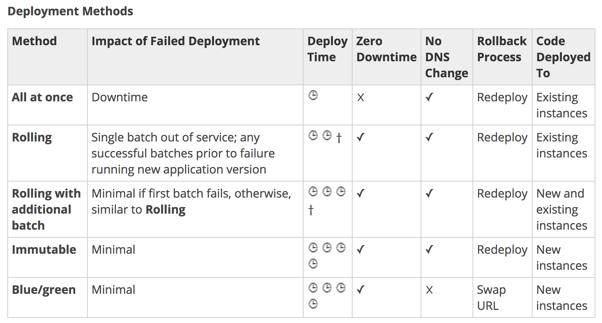

# Elastic Beanstalk

## Elastic Beanstalk Deployment Methods
### All at Once Deployments
* Elastic Beanstalk environment uses all-at-once deployments if it is created with a different client (API, SDK, or AWS CLI)
* All at Once deployments performs an in place deployment on all instances at the same time
* All at Once deployments are simple and fast, however rollback would take time in case of any issues
### Rolling Deployments
* Elastic Beanstalk environment uses rolling deployments if it is created with console or EB CLI
* Elastic Beanstalk splits the environment’s EC2 instances into batches and deploys the new version of the application to one batch at a time, leaving the rest of the instances in the environment running the old version
* During a rolling deployment, part of the instances serve requests with the old version of the application, while instances in completed batches serve other requests with the new version.

### Rolling with Additional Batch Deployments
* Rolling with Additional Batch deployments are helpful when you need to maintain full capacity during deployments
* This deployment is similar to Rolling deployments, except they do not do an in place deployment but a disposable one, launching a new batch of instances prior to taking any instances out of service
* When the deployment completes, Elastic Beanstalk terminates the additional batch of instances.
* Rolling with additional batch deployment does not impact the capacity and ensures full capacity during the deployment process

### Immutable Deployments
* All at Once and Rolling deployment method updates existing instances.
* If you need to ensure the application source is always deployed to new instances, instead of updating existing instances, environment can be configured to use immutable updates for deployments.

### Blue Green Deployments
* Blue Green approach is suitable for deployments that depend on resource configuration changes or a new version that can’t run alongside the old version
* Elastic Beanstalk enables the Blue Green deployment through Swap Environment URLs feature

