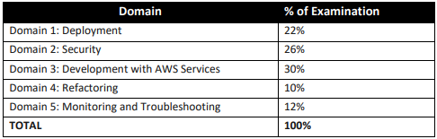

# aws-developer-associate
## Scope Of the Exam DVA-C01

## Tips
* https://d1.awsstatic.com/training-and-certification/docs-dev-associate/AWS_Certified_Developer_Associate_Updated_June_2018_Exam_Guide_v1.3.pdf
* https://medium.com/faun/passing-the-aws-certified-developer-associate-exam-c83c894cb780
* https://www.whizlabs.com/blog/aws-certified-developer-associate-exam-review/
* https://docs.aws.amazon.com/apigateway/latest/developerguide/set-up-logging.html
* https://docs.aws.amazon.com/serverless-application-model/latest/developerguide/serverless-sam-template.html#serverless-sam-template-
* https://docs.aws.amazon.com/AWSCloudFormation/latest/UserGuide/template-anatomy.html
